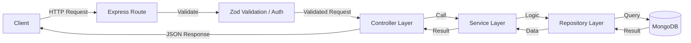
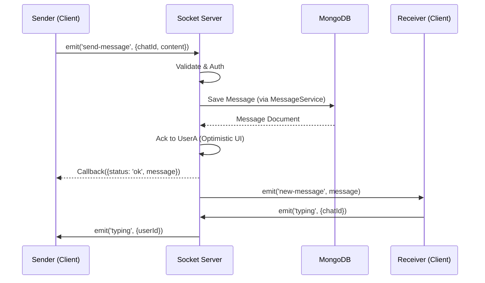

# Real-time Chat Backend

This repository contains the backend service for a real-time chat application. It provides REST APIs for resource management and a WebSocket interface for real-time messaging.

**Current Implementation**: Express.js + TypeScript
**Future Roadmap**: NestJS Implementation

The frontend stack is currently undecided/agnostic, handling clients via standard HTTP/WebSocket protocols.

## Features

- **Real-time Messaging**: Instant message delivery using Socket.IO.
- **User Authentication**: Secure login and registration (JWT/Bcrypt).
- **Group Chaos**: Group chat support with member management.
- **Rich Media**: Support for sending Images, Videos, and Audio.
- **Presence**: Online/Offline status tracking.
- **Typing Indicators**: Real-time feedback when users are typing.

## Tech Stack

### Backend Architecture (Express + TypeScript)

The backend is built following a robust **Layered Architecture** (Controller-Service-Repository pattern) to ensure separation of concerns, scalability, and maintainability.

#### Architectural Overview

The system uses `tsyringe` for Dependency Injection, ensuring that components (Controllers, Services, Repositories) are loosely coupled.

#### System Design Diagrams

**1. Request-Response Lifecycle**

**2. Real-time Event Flow (Socket.IO)**

#### Layer Breakdown

1.  **Presentation Layer (Routes & Controllers)**

    - **Routes**: Define API endpoints (`/chat`, `/message`, `/user`), map them to controllers, and enforce middleware (Authentication, File Uploads, Validation).
    - **Controllers**: Handle the HTTP request/response cycle. They extract data from requests, invoke the appropriate Service, and return standardized responses. **No business logic lives here.**
    - **Validators**: `Zod` schemas define strict data shapes (DTOs) for requests. If validation fails, the request is rejected before reaching the controller.

2.  **Business Logic Layer (Services)**

    - Classes injected with Repositories.
    - Contains all business rules (e.g., "Creating a group requires at least 2 other members", "Sending a message updates the chat's `lastMessage`").
    - Can orchestrate operations across multiple repositories.

3.  **Data Access Layer (Repositories)**

    - The only layer that interacts directly with Mongoose Models.
    - Abstracts database queries (`find`, `create`, `findByIdAndUpdate`) into named methods (`findUserChats`, `updateLastMessage`).
    - Extends a `GenericRepository` base class to reduce boilerplate for common operations.

4.  **Database (Models)**
    - **Mongoose Schemas**: Define the structure for `User`, `Chat`, and `Message` collections.
    - **Interfaces**: TypeScript interfaces (`IUser`, `IChat`, `IMessage`) ensure type safety across the application.

#### Key Technologies

- **Runtime**: Node.js
- **Framework**: Express.js
- **Language**: TypeScript
- **Real-time**: Socket.IO
- **Database**: MongoDB (Mongoose ODM)
- **Validation**: Zod
- **DI Container**: Tsyringe
