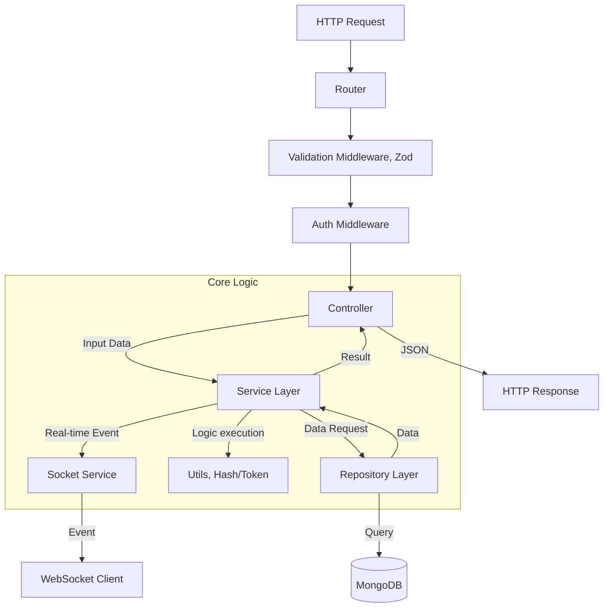
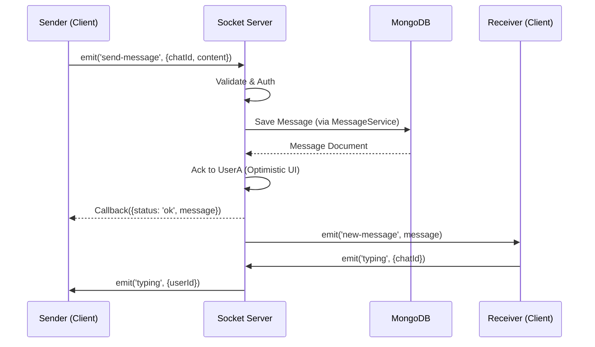

# Real-time Chat with Express

## Overview

This repository contains the backend service for a real-time chat application. It provides REST APIs for resource management and a WebSocket interface for real-time messaging. The backend is built following a robust **Layered Architecture** (Controller-Service-Repository pattern) to ensure separation of concerns, scalability, and maintainability. It leverages modern tooling for robustness:

- **Dependency Injection**: Managed by `tsyringe` (declarative, decorator-based).
- **Validation**: Schema-based validation using `zod`.
- **Database**: Mongoose ODM.
- **Real-time**: Socket.IO integration (Messaging, Online Status, Live Updates).

## Features

- **Real-time Messaging**: Instant message delivery using Socket.IO.
- **User Authentication**: Secure login and registration (JWT/Bcrypt).
- **Group Chaos**: Group chat support with member management.
- **Rich Media**: Support for sending Images, Videos, and Audio.
- **Presence**: Online/Offline status tracking.
- **Typing Indicators**: Real-time feedback when users are typing.

## Tech Stack & Architecture

**Key Technologies**:

- **Runtime**: Node.js
- **Framework**: Express.js
- **Language**: TypeScript
- **Real-time**: Socket.IO
- **Database**: MongoDB (Mongoose ODM)
- **Validation**: Zod
- **DI Container**: Tsyringe

### Project Structure

```text
src/
├── config/         # Database configuration
├── constants/      # Global constants and environment variables
├── controllers/    # Handles HTTP requests (thin layer)
├── interfaces/     # TypeScript interfaces
├── middleware/     # Auth, Validation, Error Handling
├── models/         # Mongoose Data Models
├── repository/     # Data Access Layer (Singletons)
├── routes/         # Route definitions (DI resolution)
├── services/       # Business Logic Layer (Injectable)
├── utils/          # Stateless functional utilities
├── validators/     # Zod Schemas
├── app.ts          # App configuration
└── server.ts       # Entry point (DI setup)
```

### Architecture Layers

#### 1. Presentation Layer (Controllers & Routes)

**Role**: Entry point for HTTP requests.

- **Routes**: Define API endpoints (`/chat`, `/message`, `/user`), map them to controllers, and enforce middleware (Authentication, File Uploads, Validation).
- **Controllers**: Handle the HTTP request/response cycle. They extract data from requests, invoke the appropriate Service, and return standardized responses. **No business logic lives here.**
- **Validators**: `Zod` schemas define strict data shapes (DTOs) for requests. If validation fails, the request is rejected before reaching the controller.
- **Real-time Integration**: Can trigger socket events (e.g., `emitNewChat` after specific HTTP actions).

#### 2. Business Logic Layer (Services)

**Role**: The heart of the application (Business Logic).

- **Dependency Injection**: Receives `Repositories` via constructor.
- **SocketService**: A special service managing all WebSocket logic, event listeners, and emitters.
- **Responsibility**: Contains all business rules (e.g., "Creating a group requires at least 2 other members", "Sending a message updates the chat's `lastMessage`").

#### 3. Data Access Layer (Repositories)

**Role**: Data Access Layer (DAL).

- **Singleton**: Annotated with `@singleton` for efficient reuse.
- **Responsibility**: Abstracts database queries from business logic. The only layer that interacts directly with Mongoose Models.

#### 4. Middleware

- **Validation (`validate.middleware.ts`)**: Generic middleware that validates requests against **Zod Schemas**.
- **Auth**: Verifies JWT tokens.
- **Socket Middleware**: Authenticates socket handshakes via JWT.

## System Design

### 1. Request-Response Lifecycle



### 2. Real-time Event Flow (Socket.IO)



## Dependency Injection (TSyringe)

We use **TSyringe** for declarative Dependency Injection.

- **Setup**: `import "reflect-metadata";` in `server.ts`.
- **Registration**: Decorate classes with `@singleton()` or `@injectable()`.
- **Resolution**: `container.resolve(Controller)` in routes auto-wires the dependency tree.

```typescript
// Example
@injectable()
export class UserController {
  constructor(private userService: UserService) {} // Auto-injected
}
```

## Setup & Run

1. `npm install`
2. `sudo npm install` (If permission errors occur)
3. `npm run dev` (Runs with `tsx` watch mode)
4. `mongod --dbpath path/to/your/mongodb/database` (Start MongoDB from your manual installation directory)
