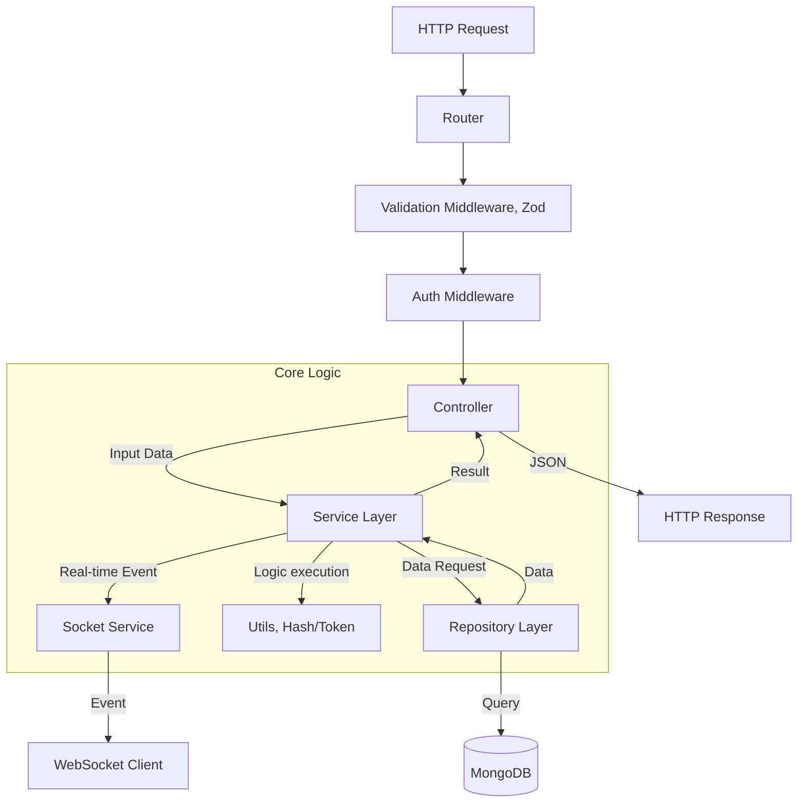

# NodeJS Chat Backend

## Overview

This backend powers the Flutter Chat Application. It follows a **Layered Architecture** combining **OOP principles** for stateful components (Services, Repositories) and **Functional Programming** for stateless utilities.

It leverages modern tooling for robustness:

- **Dependency Injection**: Managed by `tsyringe` (declarative, decorator-based).
- **Validation**: Schema-based validation using `zod`.
- **Database**: Mongoose ODM.
- **Real-time**: Socket.IO integration (Messaging, Online Status, Live Updates).

## Features

- **Auth**: JWT Access/Refresh tokens.
- **Chat**: One-on-One, Group Chats, Member Management.
- **Messaging**: Text, File attachments (Images, Video, Audio), Typying Indicators.
- **Real-time**:
  - Live socket connection.
  - Online/Offline user status.
  - Typing indicators.
  - Real-time chat list updates.

## Project Structure

```text
src/
├── config/         # Database configuration
├── constants/      # Global constants and environment variables
├── controllers/    # Handles HTTP requests (thin layer)
├── interfaces/     # TypeScript interfaces
├── middleware/     # Auth, Validation, Error Handling
├── models/         # Mongoose Data Models
├── repository/     # Data Access Layer (Singletons)
├── routes/         # Route definitions (DI resolution)
├── services/       # Business Logic Layer (Injectable)
├── utils/          # Stateless functional utilities
├── validators/     # Zod Schemas
├── app.ts          # App configuration
└── server.ts       # Entry point (DI setup)
```

## Architecture Layers

### 1. Controllers (`src/controllers`)

**Role**: Entry point for HTTP requests.

- **Dependency Injection**: Receives `Services` via constructor.
- **Responsibility**: Minimal logic. Delegates to services and formats responses.
- **Real-time Integration**: Can trigger socket events (e.g., `emitNewChat` after specific HTTP actions).

### 2. Services (`src/services`)

**Role**: The heart of the application (Business Logic).

- **Dependency Injection**: Receives `Repositories` via constructor.
- **SocketService**: A special service managing all WebSocket logic, event listeners, and emitters.

### 3. Repositories (`src/repository`)

**Role**: Data Access Layer (DAL).

- **Singleton**: Annotated with `@singleton` for efficient reuse.
- **Responsibility**: Abstracts database queries from business logic.

### 4. Middleware

- **Validation (`validate.middleware.ts`)**: Generic middleware that validates requests against **Zod Schemas**.
- **Auth**: Verifies JWT tokens.
- **Socket Middleware**: Authenticates socket handshakes via JWT.

## Workflow



## Dependency Injection (TSyringe)

We use **TSyringe** for declarative Dependency Injection.

- **Setup**: `import "reflect-metadata";` in `server.ts`.
- **Registration**: Decorate classes with `@singleton()` or `@injectable()`.
- **Resolution**: `container.resolve(Controller)` in routes auto-wires the dependency tree.

```typescript
// Example
@injectable()
export class UserController {
  constructor(private userService: UserService) {} // Auto-injected
}
```

## Setup & Run

1. `npm install`
2. `sudo npm install` (If permission errors occur)
3. `npm run dev` (Runs with `tsx` watch mode)
